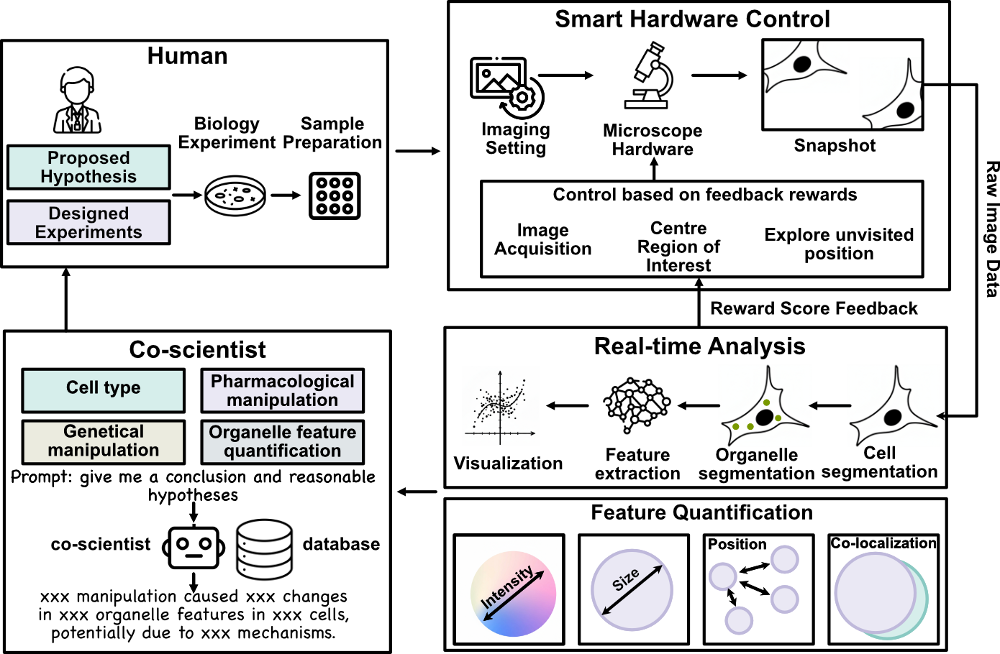
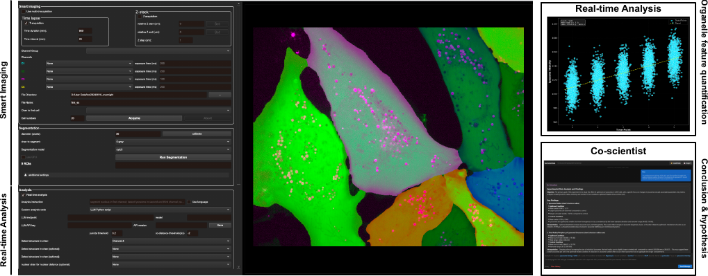
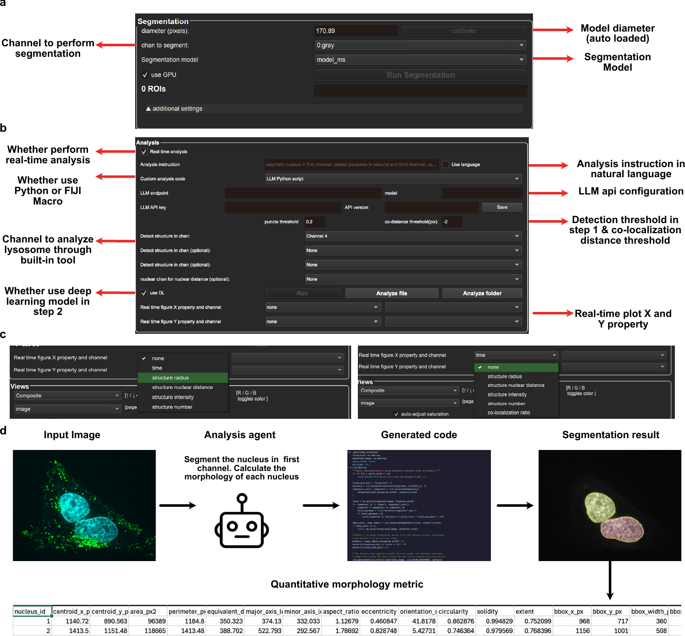
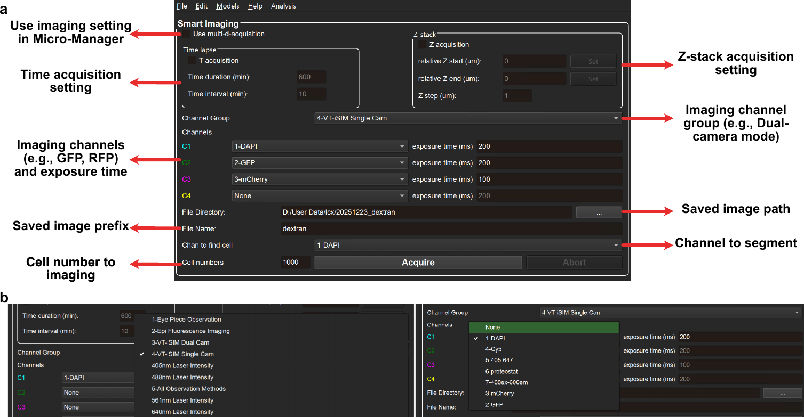

# Micro-copilot

Micro-copilot is a research software platform for fluorescence microscopy. It combines adaptive microscope acquisition, cell segmentation, lysosome and puncta quantification, channel co-localization, and optional large-language-model-assisted analysis in one desktop interface.



*Micro-copilot connects automatic imaging, real-time analysis, and researcher-guided interpretation in a human-in-the-loop agentic microscopy research cycle.*



*The graphical interface brings Smart Imaging, Real-Time Analysis, and Co-Scientist functions into one workspace.*

[](https://youtu.be/gY-msnV3gRY)

[Watch the Micro-copilot demonstration on YouTube](https://youtu.be/gY-msnV3gRY)

The internal Python package retains the historical name `cellquant` for compatibility.

## Software capabilities

| Component | Current function |
| --- | --- |
| Smart Imaging | Uses cell-segmentation feedback and a reward-based navigation policy to identify fields of view and center cells during supported microscope acquisition. |
| Real-Time Analysis | Segments cells, detects lysosomes or puncta, measures per-cell organelle properties, and calculates directional co-localization between selected channels. |
| LLM-customized analysis | Converts a natural-language analysis request into a reusable Python script or FIJI/ImageJ macro for user-defined 2D measurements. |
| Co-Scientist interface | Reads quantitative experiment outputs and supports researcher-guided interpretation and hypothesis development. |

The bundled lysosome pipeline proposes candidates with Laplacian-of-Gaussian blob detection, removes false positives and merges ring-like detections with a trained classifier, and refines detected regions locally. Co-localization is calculated from the surface-to-surface distance between structures using a k-d tree search.

## Installation

Micro-copilot requires Python 3.9 or newer. Create and activate a virtual environment, then install the desktop application from the project directory:

```bash
python -m pip install ".[gui]"
```

Install optional integrations only when needed:

```bash
python -m pip install ".[microscope]"  # Micro-Manager and Pycro-Manager integration
python -m pip install ".[llm]"         # Azure OpenAI analysis features
python -m pip install ".[image]"       # Additional ND2 and NRRD image readers
```

The bundled model weights are tracked with Git LFS. Install Git LFS before cloning or committing the repository so that the complete model files are available.

## Starting the application

Run Micro-copilot from the project directory:

```bash
python main.py
```

The installed commands and module entry point are equivalent:

```bash
micro-copilot
cellquant
python -m cellquant
```

## Image analysis

The primary offline workflow is simple: drag a microscopy image into the window, select the analysis channels, and click **Run**.

### Current analysis limitations

> [!IMPORTANT]
> - **4D images are not supported.** The current analysis workflow is intended for 2D images with up to four channels. Multichannel 3D stacks and time-lapse datasets are not processed volume-by-volume or slice-by-slice.
> - **Language mode and the built-in lysosome workflow are separate modes.** Enabling **Use language** disables the fixed-selector, built-in lysosome workflow. Leave **Use language** unchecked for the bundled lysosome analysis.
> - **LLM integration currently supports Azure OpenAI only.** Direct OpenAI API and Anthropic Claude API support are planned for future releases.

### Built-in lysosome workflow

The built-in workflow is the recommended starting point for a 2D fluorescence image.

1. Drag a `.tif`, `.tiff`, `.png`, or `.jpg` image into the window.
2. In **Segmentation**, select the cell channel and confirm the segmentation model and diameter.
3. In **Analysis**, select the channel containing the lysosome or puncta signal. Select one or two additional channels when co-localization measurements are required.
4. Keep **Use language** unchecked.
5. Adjust the puncta and co-localization distance thresholds if required.
6. Click **Run**.

Micro-copilot segments the cells, performs puncta analysis, restores the cell mask in the display, and writes the results beside the input image. Selecting two or more puncta channels produces both directional co-localization comparisons.



[Open the high-resolution analysis-panel figure](images/analysis_setting_gui.pdf)

### LLM-customized analysis

Language mode is intended for user-defined analysis that is not handled by the built-in lysosome workflow. It currently requires an Azure OpenAI deployment and the `llm` optional dependency.

1. Enter the Azure OpenAI endpoint, API key, API version, and deployed model name in the **Analysis** panel, then click **Save**.
2. Enter an instruction that identifies the target structure and channel, for example: `segment the nucleus in channel 1 and calculate its morphology`.
3. Select **LLM Python script** or **LLM FIJI macro**.
4. Enable **Use language**, then click **Run**.

Python mode generates and validates a reusable analysis script before running it on the selected 2D channel. FIJI mode requires `FIJI_PATH` or `IMAGEJ_PATH` to point to a working Fiji/ImageJ executable. Generated scripts, metadata, masks, previews, and per-cell tables are saved with the experiment outputs.

Generated analysis code must be reviewed and validated for each biological context. Use this mode only with a trusted endpoint and trusted instructions. The current release does not display the custom segmentation mask as a GUI overlay; the result is saved to disk.

#### Azure OpenAI configuration

LLM settings can be entered in the GUI or supplied through environment variables:

```bash
export AZURE_OPENAI_API_KEY="..."
export AZURE_OPENAI_ENDPOINT="https://..."
export AZURE_OPENAI_API_VERSION="2024-10-21"
export AZURE_OPENAI_MODEL="your-deployment-name"
```

Do not store credentials in the repository. GUI settings are written outside the source tree under `~/.cellquant/`. Direct OpenAI and Anthropic Claude credentials are not supported in this release.

## Smart Imaging and microscope control

Smart Imaging uses Micro-Manager through Pycro-Manager to configure channels, exposure times, time-lapse acquisition, Z acquisition, output paths, and the target number of cells. Cell-segmentation feedback guides stage navigation and field selection during acquisition.



[Open the high-resolution Smart Imaging figure](images/imaging_setting_gui.pdf)

Microscope control requires a compatible Micro-Manager configuration and must be validated for each hardware setup. The application handles a disconnected microscope safely, but acquisition behavior has not been verified on every instrument.

## Output files

Analysis outputs are written beside the input image unless noted otherwise.

| Output | Description |
| --- | --- |
| `*_analysis_cell_seg.png` | Cell-segmentation overlay for visual review. |
| `*_analysis_cell_mask.npy` | Labeled cell mask used for analysis. |
| `*_structure_chan*_cell*_time*.csv` | Per-punctum position, pixel count, intensity, nuclear distance, and channel co-localization flags. |
| `*_colocalization.csv` | Per-cell directional co-localization counts, ratios, intensities, and distance threshold. |
| `*structure_chan*.png` | Puncta detection preview for each analyzed channel. |
| `*_<object>_chan*_llm_seg.png` | Preview generated by an LLM-customized analysis. |
| `*_<object>_chan*_cell*_time*.csv` | Per-cell measurements from an LLM-customized analysis. |
| `llm_custom_analysis/` | Cached generated Python scripts or FIJI macros and their metadata. |
| `llm_custom_analysis_outputs/` | Intermediate inputs and masks produced by custom analysis. |

## Bundled models

The default model files are included in `cellquant/weights/`:

- `model_0528_resize` is the cell-segmentation model shown in the GUI as **Micro-copilot (bundled)**. Its saved 170.89-pixel diameter is loaded automatically.
- `model.pth` is the puncta classifier used to distinguish true detections, false positives, and ring-like structures.

The following environment variables override the bundled weights:

```bash
export CELLQUANT_CELLPOSE_MODEL="/path/to/cell-segmentation-model"
export CELLQUANT_PUNCTA_MODEL="/path/to/puncta-classifier.pth"
```

Other Cellpose models listed in the interface may require network access when first selected.

## Testing

Install the test dependencies and run the suite from the project directory:

```bash
python -m pip install ".[test]"
python -m pytest -q
```

The current release passed the 2D drag-and-run GUI smoke test, the bundled segmentation and puncta-model checks, two-channel co-localization export tests, and the local automated suite. See the [publish-readiness report](PUBLISH_READINESS_REPORT.md) for detailed results and remaining risks.

## Citation and attribution

If Micro-copilot contributes to published work, please cite the software repository and release version. Publication citation details will be added when available.

The segmentation engine is derived from [Cellpose](https://github.com/MouseLand/cellpose). Retain the included copyright notice and cite the relevant Cellpose publications when using or redistributing this software.

## License

This repository is distributed under the BSD 3-Clause License. See [LICENSE](LICENSE) for the complete terms.
